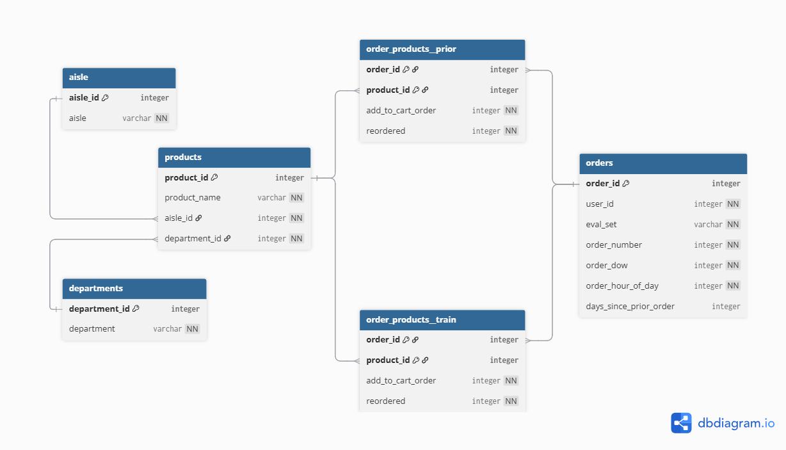

# 📢 ER Diagram for InstaCart Online Grocery Shopping 2017 Dataset

<br>

I have created a diagram (Database Schema) of this dataset for you can clearly see the overview and connections between each table.

You can find details (diagram and code) below.

<br>

## 📊 ER Diagram

<br>



<br>

## 📋 Description

- **orders table:**
    - Specify details about each customer's order (user_id).
    - order_id column is the primary key in the orders table, used to connect to the order_products__prior table.
- **order_products__prior:** Provide details about the customer's previous order information.
- **order_products__train:** Provide details regarding the customer's most recent order.
- 

<br>


<br>

```bdml
Table aisle {
  aisle_id integer [primary key]
  aisle varchar [unique, not null]
}

Table departments {
  department_id integer [primary key]
  department varchar [unique, not null]
}

Table order_products__prior {
  order_id integer [primary key]
  product_id integer [primary key]
  add_to_cart_order integer [not null]
  reordered integer [not null]
}

Table order_products__train {
  order_id integer [primary key]
  product_id integer [primary key]
  add_to_cart_order integer [not null]
  reordered integer [not null]
}

Table orders {
  order_id integer [primary key]
  user_id integer [not null]
  eval_set varchar [not null]
  order_number integer [not null]
  order_dow integer [not null]
  order_hour_of_day integer [not null]
  days_since_prior_order integer
}

Table products {
  product_id integer [primary key]
  product_name varchar [not null]
  aisle_id integer [not null]
  department_id integer [not null]
}

Ref: aisle.aisle_id < products.aisle_id
Ref: departments.department_id < products.department_id
Ref: products.product_id < order_products__train.product_id
Ref: products.product_id < order_products__prior.product_id
Ref: orders.order_id < order_products__train.order_id
Ref: orders.order_id < order_products__prior.order_id
```


