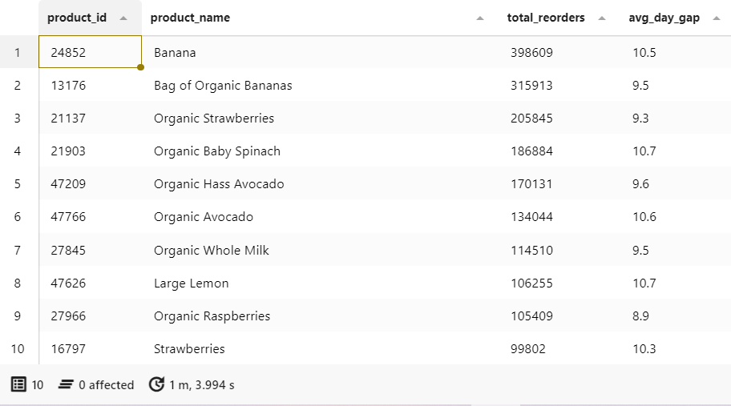
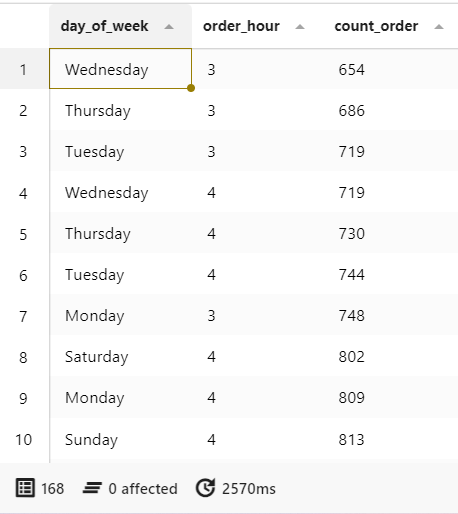

# 📢 Business Insight
I analyzed the data to find answers to three points:
1. **Golden Hour**: To find the best time to arrange staff for packing and delivery.
2. **Golden Day**: To find the peak days of each week to ensure we have enough stock for customers.
3. **Maximum Reorder**: To find out what products customers "Reorder Frequency & Cycle", in order to prepare the inventory management.
4. **Off-Peak Strategy:** To find the days and times with the fewest customer orders, in order to plan special discount such as "Flash Sale" promotion.

🔗 You can find the full script in [business-insight-queries.sql](business-insight-queries.sql).

 

## 📜 Business Insight Results
These screenshots show the results of the 3 points mentioned above.

 

### 📝 Question 1: What is the peak time for ordering?

🛎️ **Golden Hour Result:** The data shows that the peak time for customers purchase is between 9 am and 5 pm.

 

### 📝 Question 2: What are the peak days of each week for ordering?

🛎️ **Golden Days Result:** The data shows that the three days with the highest number of orders are Sunday, Monday and Tuesday.

 

### 📝 Question 3: What product do customers buy most frequently?

🛎️ **Maximum Reorder Result:** The data shows that Vegetables and fruits had the highest number of orders.

Note: Top 10 examples.

 

### 📝 Question 4: Which day has the fewest orders?

🛎️ **Off-Peak Strategy Result:** The data shows that Tuesday to Thursday are the days with the lowest sales.

Note: Top 10 examples.

