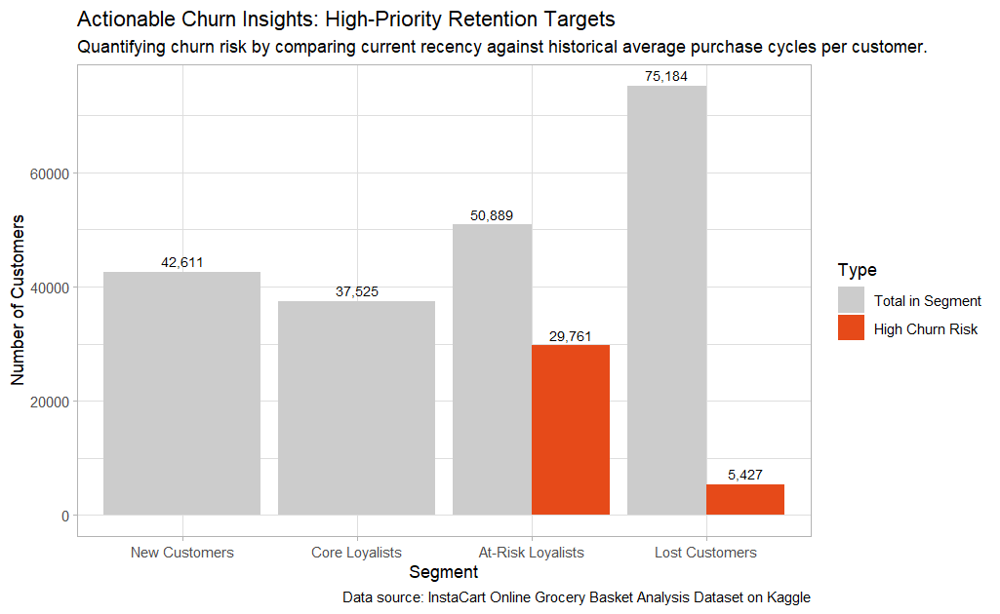

# 📢 Machine Learning: Customer Segmentation
Customer Segment ML is identification and grouping customer base on their purchasing behavior using K-means clustering.

<br>

## 🏷️ Business Motivation
- To predict customer segmentations at high risk of customer churn.
- To find stategies to encourage customers to return to the service before they permanently churn.

<br>

## 📜 Overview & Methodology

- **Algorithm:** K-means Clustering
  
- **Feature Selection:** RF (Recency & Frequency) Analysis

    **1. Recency:** The number of days since the customer's most recent order.

    **2. Frequency:** The total number of orders the customer has ever placed.

    **📝 Note:** Monetary (M) was excluded due to the lack of pricing data in the Instacart dataset.

- **Optimal K:** Selected **k=4** clusters based on business logic and customer distribution.

- 🖥️ You can find the full script in [customer-segmentation-churn-analysis.r](customer-segmentation-churn-analysis.r).

<br>
<br>

## ⌨️ Code for the K-Means Process

The code below is the K-Means process only.

<br>

```r
k <- 4

set.seed(93)
kmeans_model <- kmeans(rf_data_scaled, centers = k, nstart = 25)

rf_data$cluster <- kmeans_model$cluster

segment_summary <- rf_data %>%
  group_by(cluster) %>%
  summarise(
    avg_recency = mean(last_order_date),
    avg_frequency = mean(count_order_num),
    customer_count = n()
  ) %>%
  mutate(customer_level = case_when(
                            cluster == 1 ~ "New Customers",
                            cluster == 2 ~ "Lost Customers",
                            cluster == 3 ~ "Core Loyalists",
                            cluster == 4 ~ "At-Risk Loyalists")) %>%
  select(cluster, customer_level, avg_recency, avg_frequency,
         customer_count)
```

<br>
<br>

## 📜 Customer Segmentation Summary Table Result

<br>

The data obtained from the K-means process led to conclusions regarding customer segmentation to the following :

| Customer Segment | Description | Average Recency (Days) | Average Frequency (Orders) | Number of Customer |
| :--- | :--- | ---: | ---: | ---: |
| **Core Loyalists** | High frequency & recently active. | 5.48 | 42.30 | 37,525 |
| **New Customers**  | Recently joined & low frequency. | 5.84 | 8.41 | 42,611 |
| **⚠️ At-Risk Loyalists** | High-value customers starting to slip away. | 21.10 | 18.80 | 50,889 |
| **⚠️ Lost Customers** | Low frequency & inactive for a long time. | 25.50 | 5.89 | 75,184 |


<br>
<br>

## 📜 Predictive Churn Analysis Process

<br>

💡 Focus only *"At-Risk Loyalists"* and *"Lost Customers"*, as these two clusters have a high risk of customer churn.

- **Concept:** Instead of using fixed thresholds, we identified "High-Priority Churn Risks" for "At-Risk Loyalists" by comparing a customer's current recency against their personal historical average purchase cycle.

- **Criteria:** A customer is flagged as a "High Risk" if their current gap exceeds their personal average by 1.3x (30% delay).

- **Impact:** Identified 29,761 high-value customers (At-Risk Loyalists) who are deviating from their established purchase patterns.

<br>

The table below summarizes the number customers after I ran the code to Predictive Churn Analysis.

<br>

| Customer Segment | Predicted Churner | 🚨 High-Priority Risk |
| :--- | ---: | ---: |
| **At-Risk Loyalists** | 50,889 |  29,761 |
| **Lost Customers** | 75,184 |  5,427 |

<br>

💡 The analysis revealed that: we could potentially retain approximately 35,000 customers (out of 126,000, or 27%) through the collaboration of multiple teams.
- **At-Risk Loyalists:**  we might ask the Marketing Team to **execute targeted campaigns** such as "🎫 **Personalized Discount Coupons**" or "📞 **Customer Satisfaction Call Survey**".
- **Lost Customers:** we might ask the Customer Service Team to help send personalized **reminder messages** such as "🛎️ **We have a new product you might like**" or "⭐ **Your reward points are about to expire**".

These methods may help encourage customers to return to the service before they permanently churn.

<br>
<br>

## 📊 High-Priority Retention Chart

.


