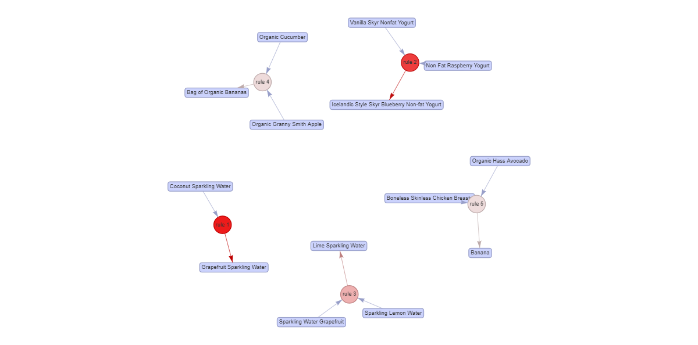
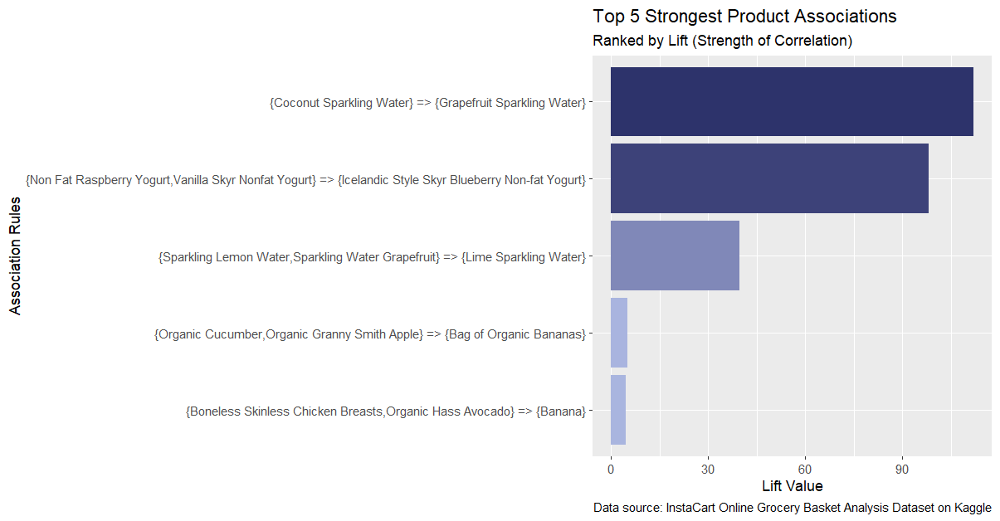

# 📢 Machine Learning: Market Basket Analysis (MBA)
Market Basket Analysis (MBA) is a model for matching products, which is most often used in marketing promotions, where customers buying product A and product B may receive a discount, etc.

<br>

## 🏷️ Business Motivation
This section explores product associations to understand customer purchasing behavior and cross-selling opportunities.

<br>


## 📜 Overview & Methodology
- **Algorithm:** Apriori (Association Rule)
- **Parameters:** Support = 0.001, Confidence = 0.6, Max Length = 3
- **Metric of Focus:** **Lift** (to identify the strongest and most meaningful associations)

- 🖥️ You can find the full script in [market-basket-analysis.r](market-basket-analysis.r).

<br>

🔔 *Note:* See here for more details about the **Parameters**.
- *Support = 0.001:* 10000*0.001 = 10 (product matching behavior at least 10 times)
- *Confidence = 0.6:* Probability of the RHS item (threshold 60%) being purchased given the LHS item
- *Max Length = 3:* Maximum items per association rule (LHS + RHS)

<br>
<br>

## ⌨️ Code for the Apriori Process

The code below is the Apriori process only.

<br>

```r
apriori_rules <- apriori(transactions, parameter = list(
  support = 0.001,  
  # 10000*0.001 = 10 (product matching behavior at least 10 times)
  
  confidence = 0.6,
  # Probability of the RHS item (threshold 60%) being purchased given the LHS item
  
  maxlen = 3
  # Maximum items per association rule (LHS + RHS)
))
```

<br>
<br>

## 📜 Table of the Top 5 High-Potential Rules

<br>

| Rule No. | LHS | RHS | Support | Confidence | Coverage | &nbsp;&nbsp;&nbsp; Lift &nbsp;&nbsp;&nbsp; | Count |
| :---: | :--- | :--- | ---: | ---: | ---: | ---: | ---: |
| [1] | Coconut Sparkling Water | => Grapefruit Sparkling Water | 0.0013 | 0.6842 | 0.0019 | 112.1657 | 13 |
| [2] | Non Fat Raspberry Yogurt, Vanilla Skyr Nonfat Yogurt | => Icelandic Style Skyr Blueberry Non-fat Yogurt | 0.0011 | 0.6875 | 0.0016 | 98.2143 | 11 |
| [3] | Sparkling Lemon Water, Sparkling Water Grapefruit | => Lime Sparkling Water | 0.0014 | 0.6364 | 0.0022 | 39.7727 | 14 |
| [4] | {Organic Cucumber, Organic Granny Smith Apple} | => {Bag of Organic Bananas} | 0.0012 | 0.6000 | 0.0020 | 5.0548 | 12 |
| [5] | {Boneless Skinless Chicken Breasts, Organic Hass Avocado} | => {Banana} | 0.0010 | 0.6667 | 0.0015 | 4.6751 | 10 |


<br>
<br>


## 📊 Visualizing Relationships

### 1. Network Graph (Product Bundling)
The network graph reveals clusters of frequently co-purchased items.

<br>

.

<br>

### 2. Top 5 Rules by Lift
The Bar Chart reverals the strength of correlation of co-purchased items.

<br>

.

<br>

### 💡 Insight & Business Value
- **Insight:** Clear clusters emerge within specific categories (e.g., Beverages) and across different categories (e.g., Meat and Produce).
- **Product Bundling:** High-lift pairs like **Sparkling Water flavors** are ideal for "Variety Packs," while cross-category links like **Chicken Breasts + Avocado + Banana** suggest "Healthy Meal Kit" opportunities.
- **Recommended products:** Recommendations such as "Frequently Bought Together" can be implemented during the checkout process to increase **Average Order Value (AOV).

