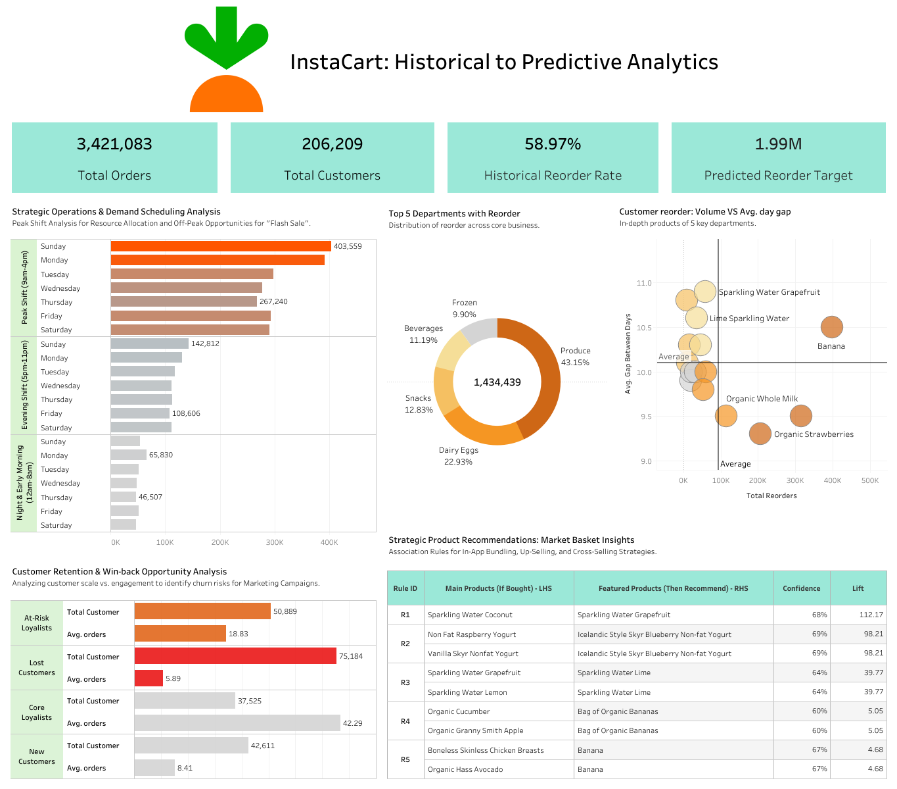
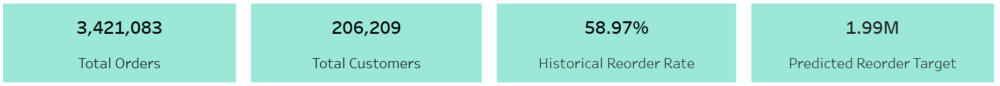
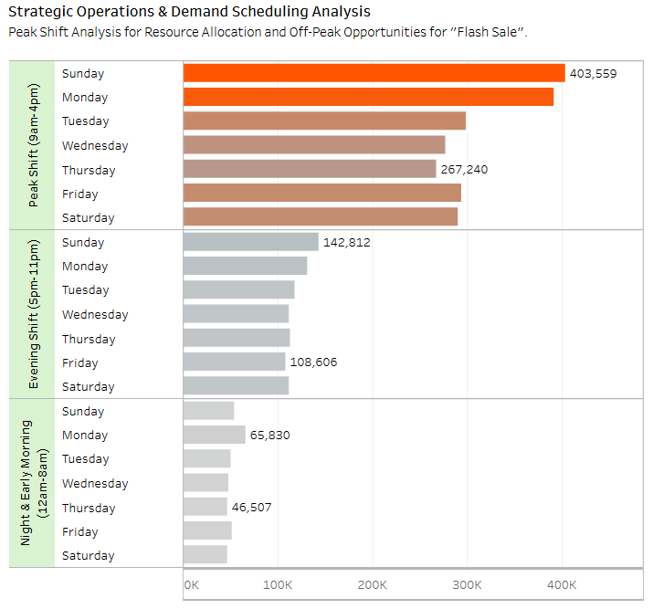

# 📢 Instacart Dashboard: Historical to Predictive Analytics
I designed a dashboard to provide an overview and to visualize predictions based on historical data from this dataset.

 

🔗 You can find the full Dashboard, please visit [Instacart Dashboard](https://public.tableau.com/views/InstacartHistoricaltoPredictiveAnalytics/Dashboard1?:language=en-US&:sid=&:redirect=auth&:display_count=n&:origin=viz_share_link)

**Note 1:** On the Instacart Dashboard, there are some interactive function, such as linking between "Donut Chart" and "Scatter Plot", and "Scatter Plot" and the "Table". Alternatively, you can use the interactive function to link two graphs ("Donut Chart & Scatter Plot") and one table simultaneously.

**Note 2:** I have broken down this overview graph into smaller graphs to explain the key aspects of each graph, as detailed below (next to the overview below).

 

 
 

## 📊 Deep Dive: Chart-by-Chart Analysis & Business Results
Below is a detailed breakdown of each dashboard component, explaining the data logic and the actionable insights derived from the analysis.

 

### 1. Executive Summary & Core KPIs

 

### 2. Strategic Operations & Demand Scheduling Analysis

**Insight:** "Peak demand occurs during specific days/hours, creating potential operational bottlenecks, while significant downtime exists during off-peak periods."

**Recommendation:**
  *- Peak Management:** Optimize logistics and staffing schedules during high-traffic windows to ensure seamless order fulfillment and prevent backlogs.
  *- Off-Peak Stimulation:* Implement targeted "Flash Sales" or time-sensitive promotions during low-demand hours to level out the workload and maximize revenue consistency throughout the week.

