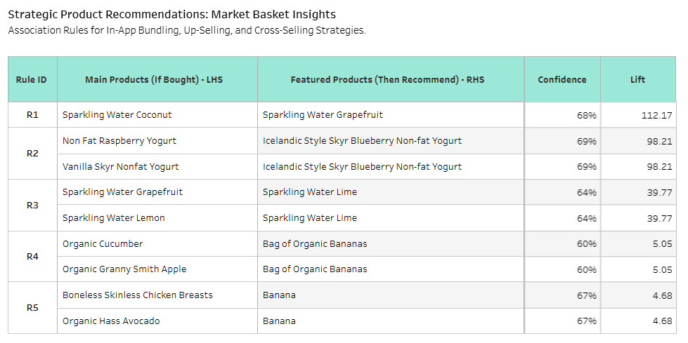

# 📢 Instacart Dashboard: Historical to Predictive Analytics
I designed a dashboard to provide an overview and to visualize predictions based on historical data from this dataset.

 

🔗 You can find the full Dashboard, please visit [Instacart Dashboard](https://public.tableau.com/views/InstacartHistoricaltoPredictiveAnalytics/Dashboard1?:language=en-US&:sid=&:redirect=auth&:display_count=n&:origin=viz_share_link)

**📝 Note 1:** The Instacart Dashboard includes several interactive features, such as linking between the "Donut Chart," "Scatter Plot," and the "Table." Alternatively, you can interact with all three components simultaneously.

**📝 Note 2:** I have broken down the overview into smaller sections to explain the key data logic and actionable insights, as detailed below.

 

 
 

## 📊 Deep Dive: Chart-by-Chart Analysis & Business Results
Below is a detailed breakdown of each dashboard component, explaining the data logic and the actionable insights derived from the analysis.

 

### Section 1: Executive Summary & Core KPIs

 

 

### Section 2: Strategic Operations & Demand Scheduling Analysis

 

**💡 Insight:** Peak demand occurs during specific days/hours, creating potential operational bottlenecks, while significant downtime exists during off-peak periods.

**💡 Recommendation:**

  - **Peak Management:** Optimize logistics, staffing schedules and inventory preparation during high-traffic periods to ensure smooth order fulfillment and prevent backlogs.

  - **Off-Peak Stimulation:** Implement **"Flash Sales"** or time-sensitive promotions during low-demand hours to distribute the workload and increase revenue consistency throughout the week.

 

 

### Section 3: Customer Retention & Win-back Opportunity Analysis

 

**💡 Insight:** The 'Risk Royalists' segment (approx. 50K customers) average around 19 orders per person. Losing this group would significantly impact long-term revenue.

**💡 Recommendation:**

   - **Proactive Engagement:** Coordinate with the Marketing team to launch personalized retention campaigns (e.g., exclusive loyalty discounts) specifically for 'Risk Royalists.'

   - **Churn Prevention:** Coordinate with Customer Service to identify pain points for 'Lost' and 'At-risk' segments. Use an **automated re-order reminder system** for bulk purchasers (these long gap-days might be mistaken as churn) to stay top-of-mind.

 

 

### Section 4: Top 5 Departments with Reorder & Customer reorder (Volume VS Avg. day gap)

 

**💡 Insight:** High-volume categories like 'Produce' (notably Bananas) show a consistent reorder cycle of approximately 9 - 10 days.

**💡 Recommendation:**

  - **Stock Optimization:** Adjust inventory replenishment cycles with the 10-day reorder frequency to minimize losses (especially for perishables) and avoid stock-outs.

  - **Resource Allocation:** Use the volume insights to forecast packing and delivery capacity requirements for the top 5 departments, ensuring the most popular items are always 'added to cart.'

 

 

### Section 5: Strategic Product Recommendations: Market Basket Insights

 

**💡 Insight:** Association Rule Mining reveals a powerful link between 'Sparkling Water Coconut' and 'Sparkling Water Grapefruit' with a **68% Confidence** and a **Lift of 112.**

📝 Note: Lift measures the strength of association between products. A 'Lift of 112' means these two products are 112 times more likely to be purchased together than by chance alone.

 

**💡 Recommendation:**

  - **UX/UI Cross-selling:** Enhance the online shopping experience by adding a "Frequently Purchased Together" feature. When a user adds the Coconut flavor, the system will immediately suggest the Grapefruit flavor.

  - **Bundle Promotions:** Leverage the 'top 5 association rules' to create "Sparkling Water Variety Packs" or "Buy 1 Get 1 or "Buy 2 Get 1" or "20% discounts" bundles to increase Average Order Value (AOV).
