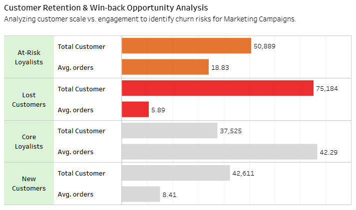
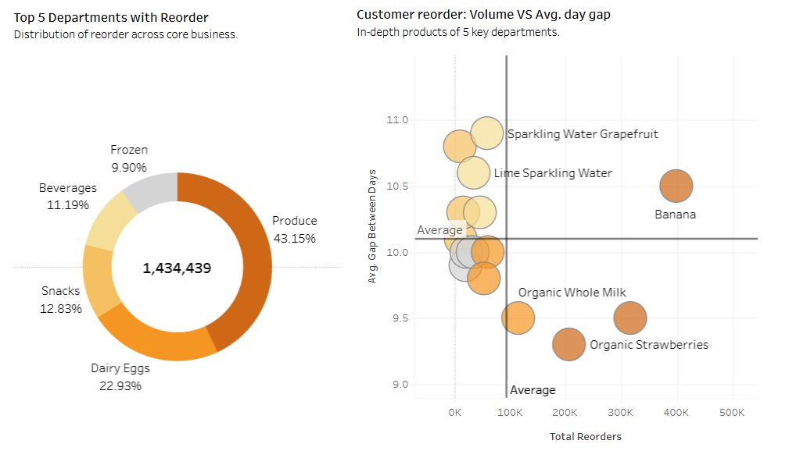

# 📢 Instacart Dashboard: Historical to Predictive Analytics
I designed a dashboard to provide an overview and to visualize predictions based on historical data from this dataset.

 

🔗 You can find the full Dashboard, please visit [Instacart Dashboard](https://public.tableau.com/views/InstacartHistoricaltoPredictiveAnalytics/Dashboard1?:language=en-US&:sid=&:redirect=auth&:display_count=n&:origin=viz_share_link)

**📝 Note 1:** On the Instacart Dashboard, there are some interactive function, such as linking between "Donut Chart" and "Scatter Plot", and "Scatter Plot" and the "Table". Alternatively, you can use the interactive function to link two graphs ("Donut Chart & Scatter Plot") and one table simultaneously.

**📝 Note 2:** I have broken down this overview graph into smaller graphs to explain the key aspects of each graph, as detailed below (next to the overview below).

 

 
 

## 📊 Deep Dive: Chart-by-Chart Analysis & Business Results
Below is a detailed breakdown of each dashboard component, explaining the data logic and the actionable insights derived from the analysis.

 

### 1. Executive Summary & Core KPIs

 

 

### 2. Strategic Operations & Demand Scheduling Analysis

 

**💡 Insight:** Peak demand occurs during specific days/hours, creating potential operational bottlenecks, while significant downtime exists during off-peak periods.

**💡 Recommendation:**

   **- Peak Management:** Optimize logistics, staffing schedules and prepare inventory during high-traffic to ensure smooth order fulfillment and prevent backlogs.

   **- Off-Peak Stimulation:** Implement "Flash Sales" or time-sensitive promotions during low-demand hours to distribute the workload and increase income consistency throughout the week.

 

 

### 3. Customer Retention & Win-back Opportunity Analysis

 

**💡 Insight:** The 'Risk Royalists' segment (approx. 50K customers) have an average around 19 orders per person. Losing this group would significantly impact long-term revenue.

**💡 Recommendation:**

   **- Proactive Engagement:** Ask the Marketing team to launch personalized retention campaigns (e.g., exclusive loyalty discounts) specifically for 'Risk Royalists.'

   **- Churn Prevention:** Coordinate with Customer Service to identify pain points for 'Lost' and 'At-risk' segments. Use automated re-order notification system for bulk purchasers (this long gap-days might be mistaken as churn) to stay top-of-mind.

 

 

### 4. Top 5 Departments with Reorder & Customer reorder (Volume VS Avg. day gap)

 

**💡 Insight:** High-volume categories like 'Produce' (notably Bananas) show a consistent reorder cycle of approximately 9 - 10 days.

**💡 Recommendation:**

**- Stock Optimization:** Adjust inventory replenishment cycles with the 10-day reorder frequency to minimize losses (especially for perishables) to avoid stock-outs.

**- Resource Allocation:** Use the volume insights to forecast packing and delivery capacity requirements for the top 5 departments, ensuring the most popular items are always 'added to card.'

