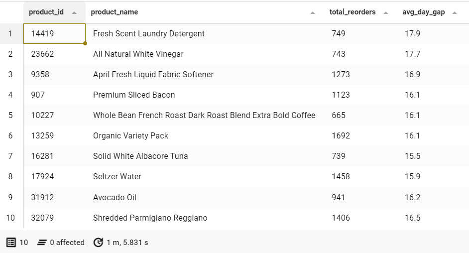

# 🛒 instacart-predictive-analytics-for-customer-behavior
Customer behavior analysis and reorder prediction using SQL, R, and Python.

 

## Database Simulation
I designed a relational schema.
You can find the full simulation script in [database-simulation.sql](./01-SQL-database-simulation/database-simulation.sql).

 

### Database Simulation Results
This screenshot shows the 'orders' table with sample data created in Beekeeper Studio.

 
 

## Business Insight
I analyzed the data to find answers to three points:
1. **Golden Hour**: Find the best time to arrange staff for packing and delivery.
2. **Golden Day**: Find the peak days of each week to ensure we have enough stock for customers.
3. **Customer Reorder Cycle**: To understand how often products are repurchased.

You can find the full script in [business-insight-queries.sql](./02-SQL-queries/business-insight-queries.sql).

 

### Business Insight Results
These screenshots show the results of the 3 points mentioned above.

 

📢 Golden Hour Result: The data shows that the peak time for customers purchase is between 9 am and 5 pm.

 

📢 Golden Days Result: The data shows that the three days with the highest number of product orders are Sunday to Tuesday.

 

📢 Customer Reorder Cycle Result: The data shows that most products follow a typical purchase cycle.
Such as "Bulk Products", like laundry detergents, are often bought monthly (on average, twice a week).

 
 

## Data Source
"Kaggle dataset": https://www.kaggle.com/datasets/yasserh/instacart-online-grocery-basket-analysis-dataset/data
